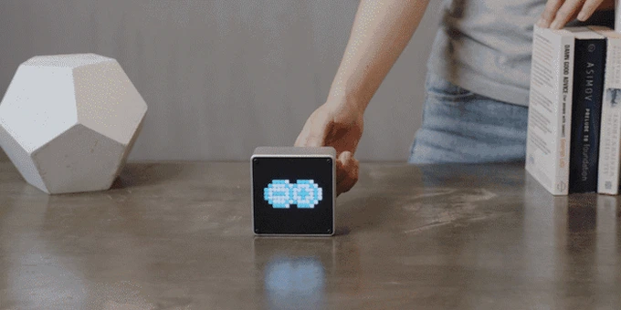
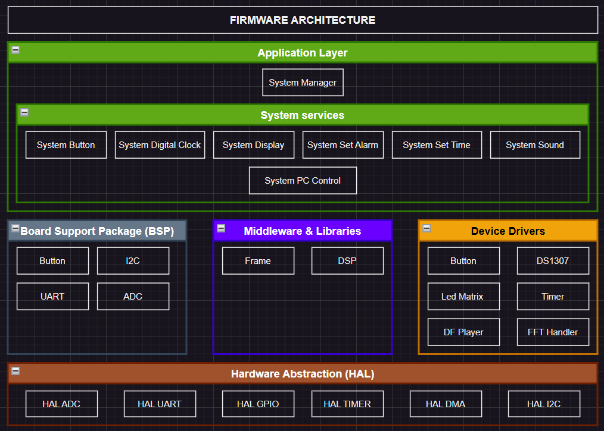

# Pisker clock

## Purpose

The goal of the Pisker project is to create a convenient and intelligent smart desk clock. Pisker is more than just an ordinary alarm clock; it also functions as a speaker. The clock will feature additional functionalities such as notifications, sound adjustment, and user interaction through an RGB matrix LED and control buttons. Additionally, there will be UI controls for managing the device.

## Features

The project includes the following features:

1. **Time Display**: The device can display the time (hours, minutes, seconds) and date on the screen.

2. **Alarm and Notifications**: The clock can set timers, alarm, countdowns.

3. **Music player**: User can play music via SD card.

4. **Rhythm light**: Device can display sound wave of the music.

5. **Computer Interaction Capability**: User can set the time and alarm via UART for Pisker.

## Required Modules

| Module               | Functionality                                     |
| ---------------------| ------------------------------------------------- |
| STM32F4-DISCO        | Main microcontroller for the device               |
| DS1307               | Real-time clock module for timekeeping            |
| Speaker (5W or 2W)   | Audio module for notifications and song player    |
| RGB Matrix Led 16x16 | Main display                                      |
| Sound sensor            | Collect sound sample                 |
| BUTTON               | User interaction module for input                 |

## Detailed Features
1. **Time and Date Display**
   
| ID  | Functionality                  | Note       |
| --- | ------------------------------ | ---------- |
| 01  | Time Display | Display Hour, Minute, Second |
| 02  | Date Display | Display Date, Month, Year    |

2. **Set time, Set date and Notifications**

| ID  | Functionality | Note                                |
| --- | ------------- | ----------------------------------- |
| 01  | Set time      | Set Hour, Minute, Second            |
| 02  | Set date      | Set Date, Month, Year               |
| 03  | Alarm         | Set alarm time up to 3 alarm        |

3. **Music player**

| ID  | Functionality      | Note                             |
| --- | ------------------ | ---------------------------------|
| 01  | Music player       | User can play music via SD card  |

4. **Rhythm light**

| ID  | Functionality         | Note                                                            |
| --- | --------------------- | --------------------------------------------------------------- |
| 01  | Rhythm light display    | Device can display sound wave rhythm with the music that is playing or any sound around|

5. **Computer Interaction Capability**
   
| ID  | Functionality             | Note                                                                    |
| --- | ------------------------- | ----------------------------------------------------------------------- |
| 01  | Set time, alarm for digital clock using command | User can use Terminal app on PC to set time and date for the digital clock |

## Firmware Architecture

## Developer Team
1. **Lu Trung Tin**
2. **Nguyen Nhat Tri**
3. **Pham Bao Loc**
